# Why did I prepare this?

Russian translation

Как объяснение того, как я вижу вещи и 
что я думаю, и как помощь и ресурс, чтобы 
думать в свое собственное время и в своем 
собственном темпе.

As an explanation of how I see stuff and what I think, and as a help and resource to think on your own time and at your own pace. 

Bible motivation:

Mark 8:35-36

[English](https://www.biblegateway.com/passage/?search=Mark+8%3A35-36&version=KJV)  

[Russian](https://www.biblegateway.com/passage/?search=Mark+8%3A35-36&version=RUSV)   

[Polish](https://www.biblegateway.com/passage/?search=Mark+8%3A35-36&version=UBG)    

> I suspect I might loose something for the Gosples sake, I'm willing to do that
> 
> Я подозреваю, что могу что-то потерять ради Евангелия, но я готов к этому.

John 5,39

[English](https://www.biblegateway.com/passage/?search=John+5%3A39&version=KJV)  

[Russian](https://www.biblegateway.com/passage/?search=John+5%3A39&version=RUSV)   

[Polish](https://www.biblegateway.com/passage/?search=John+5%3A39&version=UBG)    

> As a Christian I should Search the scriptures
> 
>Как христианин я должен искать в Писании

2 Timothy 3:16-17

[English](https://www.biblegateway.com/passage/?search=2+Timothy+3%3A16-17&version=KJV)  
[Russian](https://www.biblegateway.com/passage/?search=2+Timothy+3%3A16-17&version=RUSV)   
[Polish](https://www.biblegateway.com/passage/?search=2+Timothy+3%3A16-17&version=UBG)    

> All the Bible is good for doctrine and correction
>
> Вся Библия полезна для учения и исправления

2 Timothy 2:15

[English](https://www.biblegateway.com/passage/?search=2+Timothy+2%3A15&version=KJV)  
[Russian](https://www.biblegateway.com/passage/?search=2+Timothy+2%3A15&version=RUSV)   
[Polish](https://www.biblegateway.com/passage/?search=2+Timothy+2%3A15&version=UBG)

> I should study the Word of God or put an effort into it
>
> Я должен изучать Слово Божье или прилагать к этому усилия

# How to use this?

### If you want to spend a minimal amount of time:
1h3m - [Robert Breaker, pastor](https://www.youtube.com/watch?v=q1mKtq1BBDA)

### How can you approach this?

Russian translation

В этой папке находятся все ресурсы, которые я хотел бы использовать в файлах в формате markdown, их легко открыть и прочитать в браузере.

Вы можете либо:
- Пройтись по пунктам туплита один за другим (я пронумеровал файлы для удобства)
- Перейти непосредственно к файлу resources.md и смотреть/читать с опцией автоперевода

In this folder you have all the resources I would like to use in markdown files, they are easy to open and read in the browser.

You can either:
- Go over tuplit points one by one(I number the files for convenience)
- Go directly to the resources.md and watch/read with auto translate option

### From my side

Russian translation

Я не эксперт, я могу ошибаться, я просто любопытный 
верующий в Библию, спасенный по благодати христианин.

Я знаю, что люди могут придерживаться разных позиций, идей 
и так далее. Моя цель - просто немного прояснить некоторые 
подходы.

Я старался выбирать умеренных пасторов.

Я думаю, что полезно иметь собственное мнение по некоторым 
вопросам, поэтому полезно знать обе стороны по некоторым 
темам. Поскольку я думаю, что вы, возможно, сталкивались с 
одной стороной, я хочу представить вам другую.

Я считаю, что вы можете сами принять решение и решить для 
себя.

Я постараюсь предоставить всевозможные ресурсы на трех 
языках
польском, английском и русском. Если это невозможно, я 
также предоставил инструкции по автопереводу веб-страницы 
или видео на YouTube.

I'm not an expert, I might be wrong, I'm just curious 
Bible Believing, Saved By Grace Christian.

I know that people might hold different positions and 
ideas, and so on. My goal is just to clarify some 
approaches a bit.

I've strived to choose moderate pastors

I think it's beneficial to make up your own mind about 
some topics, that's why it's good to know both sides about 
some topics. Since I think you might have encountered one 
side, this is to provide another one.

I believe you can make up your own mind, and decide for 
yourself.

I'll try to provide all kinds of resources in 3 languages
Polish, English, and Russian. If it's not possible I also 
provided instructions on how to autotranslate either a 
webpage or a YouTube video.

### Every place I'll quote from 3 Bibles

- Polish - UWG(Uwspółcześniona Biblia Gdańska)
- English - KJV(King James Version)
- Russian - RUSV(Russian Synodal Version, not sure if this is good one, prefer non catholic/non east ortodox translation)

All of those can be found here:
[Bible gateway](https://www.biblegateway.com/)

### What is my advise?

Russian translation

Я настоятельно рекомендую вам проводить самостоятельные 
исследования, изучать материал самостоятельно, сначала 
читать, думать об этом, затем задавать вопросы и смотреть, 
есть ли в этом смысл. 

Я призываю вас молиться перед исследованием, просить 
Святого Духа и Бога о руководстве и открывать для себя 
вещи Божьи, а не человеческие. 

Я призываю вас читать Библию, если кто-то приводит цитаты 
из Библии, идите туда и читайте сами.

Я призываю вас читать цитаты в контексте, читая немного до 
(4-5 стихов и 3-4 после), чтобы понять, имеет ли чья-то 
интерпретация смысл, или она вырвана из контекста.

Я призываю вас спросить Святого Духа и себя... библейское 
ли это толкование?

Вот почему: Если я цитирую что-то (небольшую часть), я 
также стараюсь дать ссылку на Библию с более широким 
контекстом.

I strongly encourage you to investigate yourself, to look 
into stuff by yourself, first read think about it then ask 
questions and see if makes sense. 

I encourage you to pray before investigation, ask Holy 
Spirit and God for guidance and to discover things of God, 
not of man. 

I encourage you to read the Bible, if somebody gives 
quotes from the Bible go there, and read by yourself.

I encourage you to read a quote in context, reading a 
little bit before(4-5 verses, and 3-4 afterward) to figure 
out if someone's interpretation makes sense, or is it out 
of context.

I encourage you to ask the Holy Ghost and yourself... is 
this Biblical?

That's why: If I quote something(small part) I will also 
strive to provide a link to the Bible with wider context.

# (Translation) How to use videos and english material?

Russian translation

В большинстве видеороликов сейчас есть возможность 
использовать функцию автоперевода, например: на русские 
субтитры.

Ниже приведена инструкция по ее включению:

In most videos now there is possbility to use 
autotranslation feature, for example: to Russian subtitles.

Here is instruction how to turn it on:

How to turn on autotranslation - Visual Instruction - CLICK ME

Russian translation

1. Перейдите к видео, пример [Consciousness and Language Acquisition](https://www.youtube.com/watch?v=2i8AzjxwhSU)

2. Нажмите на значок шестеренки

3. Нажмите на субтитры (у вас должны быть включены аннотации)

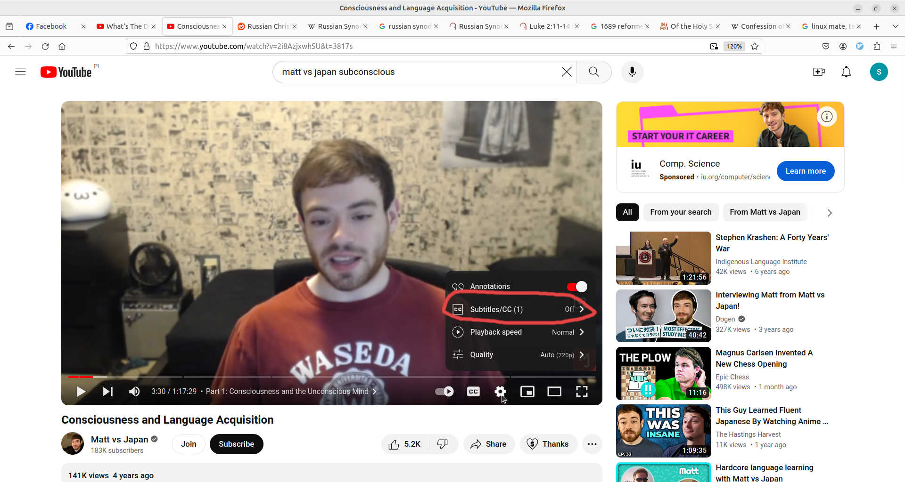

4. Включите автоперевод на английский

(это открывает возможность автоперевода на другие языки)

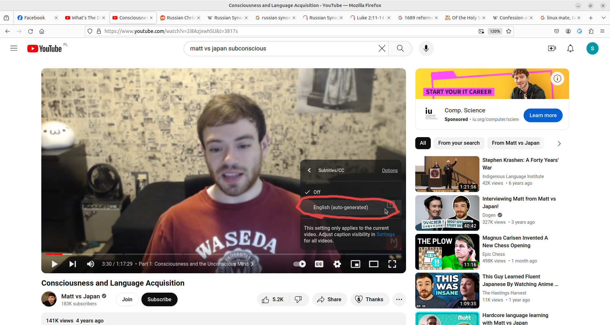

5. Вернитесь на то же место, значок шестеренки -> субтитры, на этот раз там должна быть опция автоперевода, нажмите ее

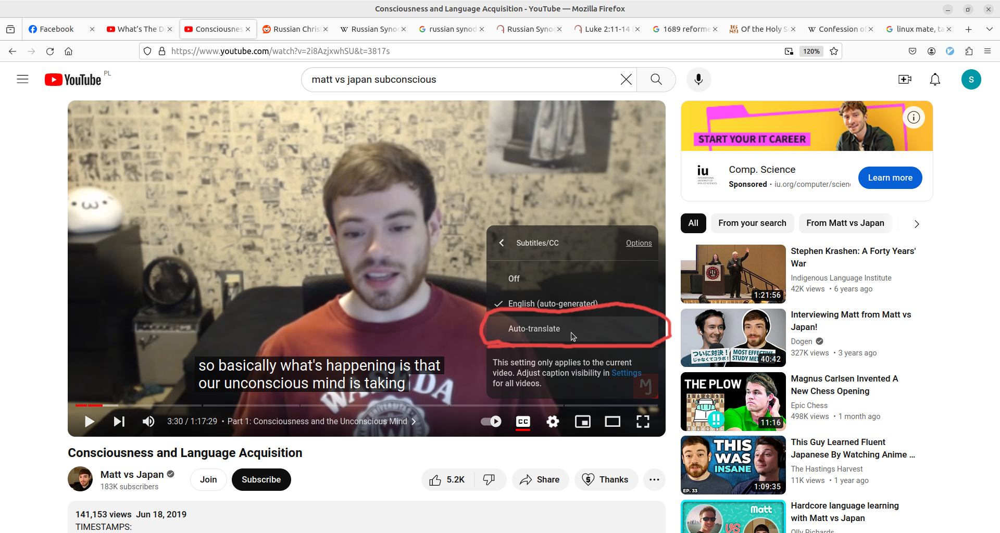

6. Выберите язык для автоперевода (например, русский)

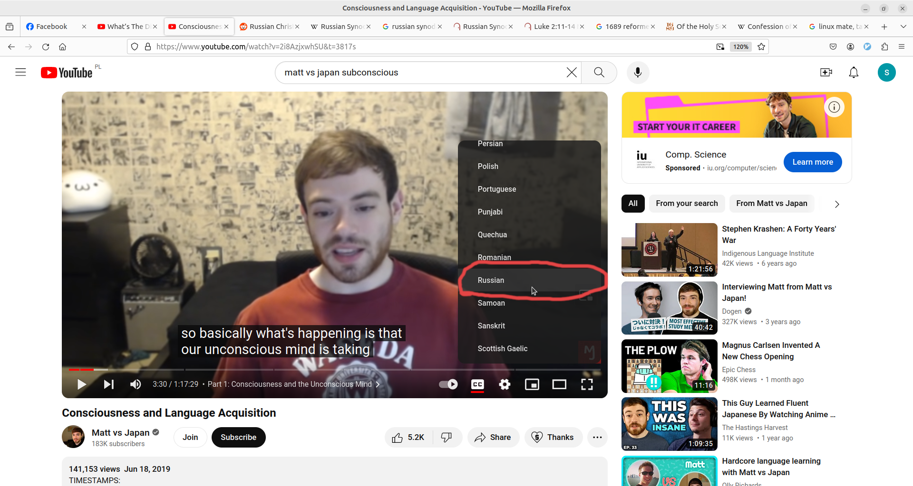

7. Наслаждайтесь видео с автопереводом

(перевод не идеальный, но достаточно хороший)

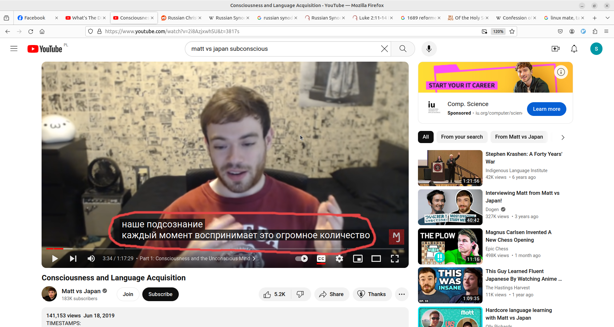

1. Go to the video, example [Consciousness and Language Acquisition](https://www.youtube.com/watch?v=2i8AzjxwhSU)

2. Click on the gear icon

3. Click on Subtitles(you need to have annotations turned on)

4. Enable english autotranslated

(this opens autotranslation form more languages)

5. Go back to the same place, gear icon -> subtitles, this time there should be autotranslate option, click it

6. Pick language to autotranslate(eg: Russian)

7. Enjoy video with autotranslated language

(translation is not perfect but good enough)

 

Autotranslate web pages - CLICK ME

All this instruction applies to chrome browser only

Все эти инструкции относятся только к браузеру chrome

Russian translation

1. Перейдите на любую страницу wab/предоставленную ссылку
2. Нажмите на маленький значок перевода в адресной строке

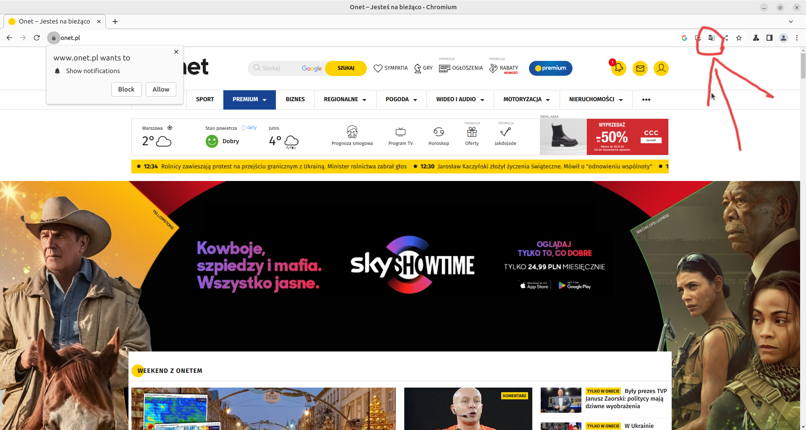

В случае, если веб-страница на английском языке, значок может отсутствовать!

В этом случае щелкните правой кнопкой мыши на любом пустом месте веб-страницы и нажмите tanslate to .....

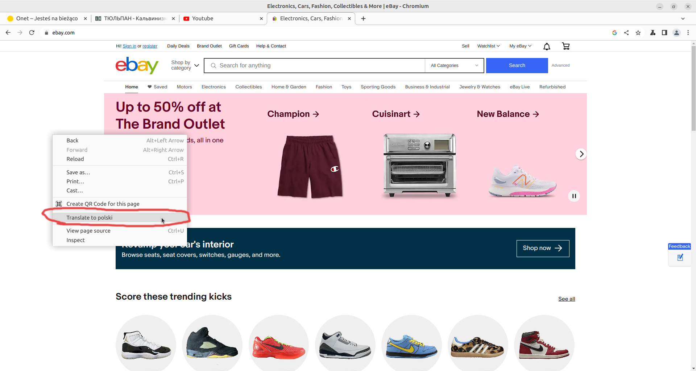

3. Нажмите на 3 точки справа (чтобы найти другие языки, кроме английского)

4. Нажмите "Выбрать другой язык

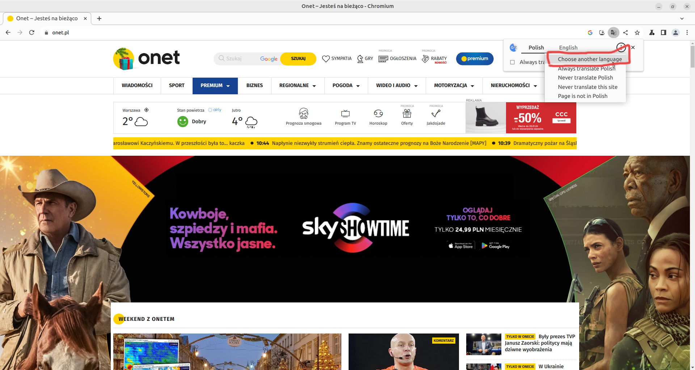

5. Нажмите на "Английский", и у вас появится больше вариантов, выберите язык, на который вы хотите перевести

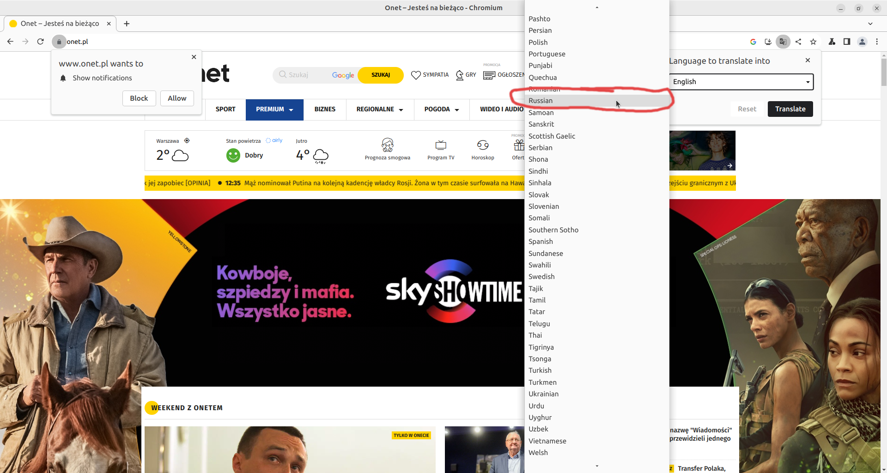

6. Чтобы утвердить перевод, нажмите кнопку перевести
   
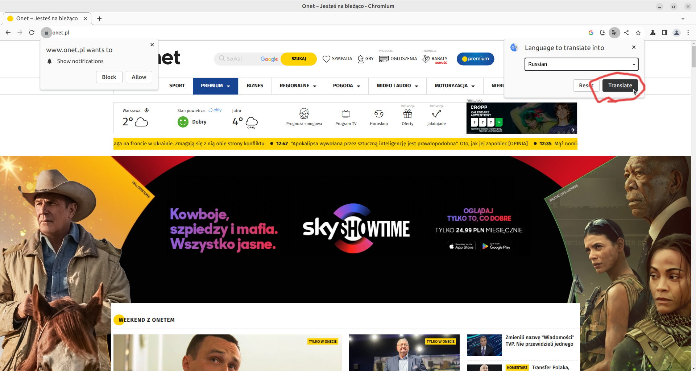

7. Наслаждайтесь переведенной веб-страницей

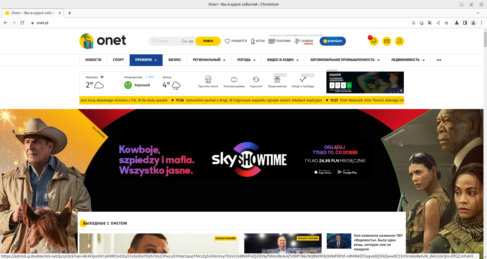

1. Go to any wab page/provided link
2. Click small translate icon in address bar

In case when webpage is in english icon might be missing!

In that case right click in any empty space in the webpage and click tanslate to ....

3. Click 3 dots on right side(to find more languages than english)

4. Click 'Choose another language'

5. Click on the 'English' and you should see more options, click the language you want to translate to

6. To approve translation, click translate
   

7. Enjoy translated webpage

